  

<h1 data-importer="text" align="left">Hi 👋, I'm Fernando Arthur</h1>

###

###

<h3 data-importer="text" align="left">Back-End Development Student</h3>

###

<h3 data-importer="text" align="left">🛠️ Technologies</h3>

###

  
  
  
  
  
  
  
  
  

###

<h2 data-importer="text" align="left">🌐 Social</h2>

###

  

  

###

<h2 align="left">📊 GitHub Stats</h2>

  
  

###

<h2 data-importer="text" align="left">🎮 Contribution Graph</h2>

###

<picture data-importer="pacman">
  <source media="(prefers-color-scheme: dark)" srcset="https://raw.githubusercontent.com/fagpc044/fagpc044/pacman-output/breakout-contribution-graph-dark.svg?game=breakout">
  <source media="(prefers-color-scheme: light)" srcset="https://raw.githubusercontent.com/fagpc044/fagpc044/pacman-output/breakout-contribution-graph.svg?game=breakout">
  
</picture>

###
